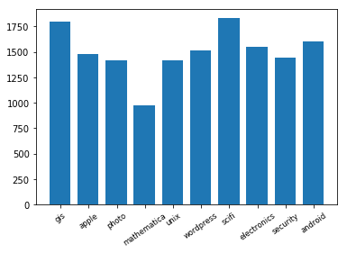

# Stack Exchange Question Classifier

Stack Exchange é um repositório de informações que possui 105 tópicos diferentes e cada tópico tem uma acervo de perguntas que foram feitas e respondidas por membros experientes da comunidade do StackExchange. Os tópicos são tão diversos quanto viagens, culinária, programação, engenharia e fotografia. Foram escolhidos 10 categoria de tópicos (gis, security, photo, mathematica, unix, wordpress, scifi, electronics, android, apple) e dada uma pergunta e um trecho, sua tarefa é identificar quais dentre os 10 tópicos a que pertence.


```python
import json
import numpy as np
import pandas as pd
import matplotlib.pyplot as plt
from sklearn.naive_bayes import MultinomialNB
from sklearn.linear_model import SGDClassifier
from sklearn.feature_extraction.text import CountVectorizer
from sklearn.feature_extraction.text import TfidfTransformer
from sklearn.feature_extraction.text import TfidfVectorizer
```

### 1. Leitura e formatação dos dados


```python
data = pd.read_json('training.json', orient='records')
```

Para executar algoritmos de aprendizado de máquina, precisamos converter os arquivos de texto em vetores de features numéricas. Nós estaremos usando o modelo 'bag of words' para o nosso exemplo. Resumidamente, nós segmentamos cada arquivo de texto em palavras (dividido pelo espaço) e contamos o número de vezes que cada palavra ocorre em cada documento e finalmente atribuímos a cada palavra um ID inteiro. Cada palavra única no nosso dicionário irá corresponder a uma característica 


```python
# df = CountVectorizer(stop_words='english', strip_accents='unicode', lowercase=True, min_df=3, max_df=0.9, ngram_range=(1, 2), max_features=19000)
df = CountVectorizer()


data_test = data['excerpt'] + ' ' + data['question']

y = data['topic']

X_train = df.fit_transform(data_test)
X_train.shape

```


    (20219, 32263)


Selecionando cada tipo de variável (features e target) do conjunto de dados. Apenas contar o número de palavras em cada documento tem um problema: ele dará mais peso a documentos mais longos do que documentos mais curtos. Para evitar isso, podemos usar a frequência (TF - Term Frequencies) e, também, podemos até reduzir o peso de palavras mais comuns (TF-IDF - Term Frequency times inverse document frequency).


```python
tfidf_transformer = TfidfTransformer()
X_train_tfidf = tfidf_transformer.fit_transform(X_train)
X_train_tfidf.shape
```


    (20219, 32263)


### 2. Treinamento

Existem vários algoritmos que podem ser usados para classificação de texto, vamos usar Naive Bayes do sklearn e o SGDClassifier para comparar a performance entre eles.


```python
#Naive Bayes
naive_bayes = MultinomialNB(fit_prior=False)

#SGDClassifier
clf = SGDClassifier(loss='modified_huber', penalty='l2', alpha=1e-4, random_state=42)
```


    SGDClassifier(alpha=0.0001, average=False, class_weight=None, epsilon=0.1,
           eta0=0.0, fit_intercept=True, l1_ratio=0.15,
           learning_rate='optimal', loss='modified_huber', max_iter=None,
           n_iter=None, n_jobs=1, penalty='l2', power_t=0.5, random_state=42,
           shuffle=True, tol=None, verbose=0, warm_start=False)


### 3. Teste

Leitura dos arquivos de teste (input00.txt), transformação do arquivo de teste para utilizá-lo nos algoritmos e leitura do arquivo com a classificação correta (output.txt). 


```python
data_test_json = pd.read_json('input00.txt', orient='records')
y_true = pd.read_csv('output00.txt', header=None, names=['labels'])

X = data_test_json['excerpt'] + data_test_json['question']
X_test = df.transform(X)
X_test_tfidf = tfidf_transformer.fit_transform(X_test)
```

Vamo executar o naive bayes com os dados de teste apenas como 'bag of words' e com o tratamento do TF-IDF para observamos o impacto que essa abordagem pode trazer.


```python
naive_bayes.fit(X_train, y)
y_pred = naive_bayes.predict(X_test)
print(np.mean(y_pred == np.array(y_true['labels']) ))
```

    0.9069984034060671
    


```python
naive_bayes_tfidf.fit(X_train_tfidf, y)
y_pred = naive_bayes_tfidf.predict(X_test)
print(np.mean(y_pred == np.array(y_true['labels']) ))
```

    0.8504523682810006
    

Vamo seguir a mesma abordagem, executando o SGDClassifier com os dados de teste apenas como 'bag of words' e com o tratamento do TF-IDF para observamos o impacto que essa abordagem pode trazer nesse algoritmo.


```python
clf.fit(X_train, y)
y_pred = clf.predict(X_test_tfidf)
print(np.mean(y_pred == np.array(y_true['labels']) ))
```

    0.6252660989888238
    


```python
clf.fit(X_train_tfidf, y)
y_pred = clf.predict(X_test_tfidf)
print(np.mean(y_pred == np.array(y_true['labels']) ))
```

    0.922166045769026
    

Utilizamos o Grid Search para encontrar a melhor configuração de parâmetros para o SGDClassifier, que apresentou melhor pontuação na predição das classes procuradas.


```python
from sklearn.model_selection import GridSearchCV
params={ 'loss': ('hinge', 'log', 'modified_huber', 'squared_hinge', 'perceptron'),
        'penalty':('none', 'l2', 'l1', 'elasticnet'), 
       'alpha':(1e-2, 1e-3)}
gs_clf = GridSearchCV(clf,param_grid=params)
gs_clf = gs_clf.fit(X_train_tfidf, y)
```


```python
gs_clf.best_score_
```


    0.8985607596814877


```python
gs_clf.best_params_
```


    {'alpha': 0.001, 'loss': 'modified_huber', 'penalty': 'l2'}


Gráfico com a quantidade de vezes que cada categoria foi predita pelo algoritmo SGDClassifier.


```python
from collections import Counter

labels, values = zip(*Counter(y_pred).items())

indexes = np.arange(len(labels))
width = 0.75

plt.bar(indexes, values, width)
plt.xticks(indexes + width * 0.025, labels, size='small',rotation=35)
plt.show()
```




